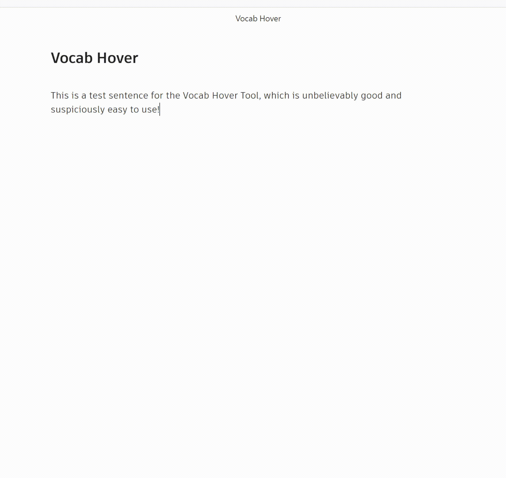
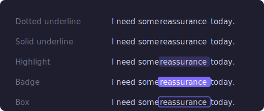
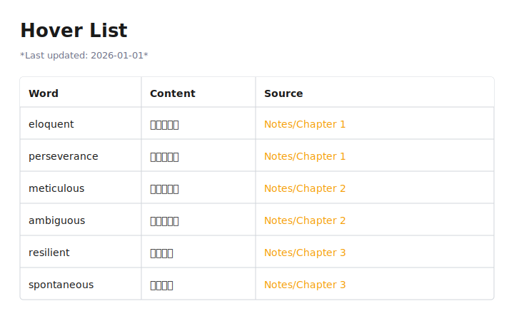

# Vocab Hover

An [Obsidian](https://obsidian.md) plugin that lets you add hover tooltips to any word — great for vocabulary learning, annotations, or quick references.

## Demo

Hover over a marked word to see its tooltip:



## How to Use

### Adding a tooltip

1. **Select** any word or phrase in the editor
2. **Right-click** → **Add Hover Content**
3. Type the tooltip text (e.g. a translation or definition)
4. Press **Enter** or click **Confirm**

The word is saved as `{word::tooltip}` in your note.

### Viewing tooltips

Switch to **Reading View** and hover over any underlined word to see its tooltip.

### Word highlight style

You can choose how marked words appear in Reading View. Open **Settings → Vocab Hover → Word highlight style** and pick one of the following:



The style applies instantly — no need to reload.

### Vocabulary list

All marked words across your vault can be collected into a single reference note.

1. Open **Settings → Vocab Hover**
2. Click **Generate**



A note (default: `Vocabulary List.md`) will be created with a table of every word and its content, linked back to the source note. Once generated, the list updates automatically whenever you save any note.

The note path can be changed in settings.

### Manual syntax

You can also type the syntax directly:

```
The {diffuse::漫射} map controls the base color.
```

## Installation

### From Obsidian Community Plugins

1. Open **Settings → Community Plugins**
2. Disable Safe Mode if prompted
3. Click **Browse** and search for **Vocab Hover**
4. Click **Install** then **Enable**.

### Manual Installation

1. Download `main.js`, `manifest.json`, and `styles.css` from the [latest release](https://github.com/chingchen0119/obsidian-vocab-hover/releases/latest)
2. Copy them into your vault at `.obsidian/plugins/vocab-hover/`
3. Enable the plugin in **Settings → Community Plugins**

## License

[MIT](LICENSE)
